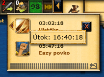
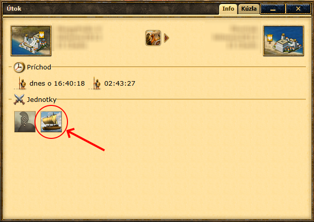

# 🚀 CSDetector

Tento Tampermonkey userscript automaticky analyzuje prichádzajúce nepriateľské útoky v hre a deteguje zloženie jednotiek.  

- Dokáže rozpoznať **všetky typy jednotiek**, s výnimkou **mýtických**, ktoré zatiaľ nepodporuje.  
- Skript **neberie do úvahy žiadne bonusy ani špeciálne efekty**.  
- Je **primárne zameraný na detekciu osídľovacej lode (OL)**, pretože tá rozhoduje o tom, či hrozí strata mesta.  
- Okrem toho je spoľahlivý aj pri detekcii **katapultov (po ostrove, nie po vode)**, kde poskytuje presné výsledky.
- Ide o odhad, nie o presné určenie prichádzajúceho útoku

Vďaka tomu máš jednoduchý prehľad, či útok obsahuje osídľovaciu loď alebo katapult, a nemusíš sa spoliehať na odhady.  
Skript tak pomáha rýchlejšie reagovať na hrozby a šetriť čas pri kontrole útokov.

---

## ⚙️ Inštalácia

Klikni na tlačidlo nižšie a skript sa nainštaluje priamo do Tampermonkey:

### Manuálna inštalácia
1. Nainštaluj si [Tampermonkey](https://www.tampermonkey.net/) (ak ho ešte nemáš).  
2. Otvor [tento link na raw skript](https://github.com/megy123/Grepolis-public/blob/main/Scripts/CSDetector/src/myscript.user.js).
3. Tampermonkey sa opýta, či chceš skript nainštalovať → potvrď.

---

## 🕹️ Používanie

- Po nainštalovaní sa skript automaticky spustí vždy, keď máš otvorenú hru.  
- Pri prichádzajúcich útokoch vyhodnotí zloženie flotily.  
- Na základe času, kedy bol útok odoslaný odhadne najpomalšiu jednotku a zobrazí ju v okne prichadzajúceho útoku.  
- Všetko funguje na pozadí, netreba nič manuálne zapínať.  

> [!WARNING]  
> Skript ešte nie je úplne dokončený, preto ho odporúčam používať najmä na detekciu OL, čo je jeho hlavný účel, a Katapultov (po súši, nie po vode). Pri týchto jednotkách sa mi zatiaľ nestalo, že by sa odhad pomýlil, na rozdiel od iných.

> [!CAUTION]  
> Script v akutuálnej verzii nezahŕňa všetky mýtické jednotky a nepočíta z bonusmi na rýchlosť ako je *Topánka* alebo výskumy *Meteorológia*, *Osadenie plachiet*, *Kartografia*.

### Ukážka použitia

1. Rozklikni prichadzajúce útoky cez ikonu aktívnych príkazov pre dané mesto **(nie prehľad administátora)**.

2. Otvor okno útoku a skontroluj najpomalšiu jednotku v útoku.

---

## 📋 Požiadavky

- **Prehliadač:** Chrome, Firefox alebo iný kompatibilný.  
- **Rozšírenie:** [Tampermonkey](https://www.tampermonkey.net/).  

---

## 🛠️ Príspevky a chyby

Ak narazíš na bug alebo máš nápad na vylepšenie, vytvor [issue](https://github.com/megy123/Grepolis-public/issues) v tomto repozitári.

---

